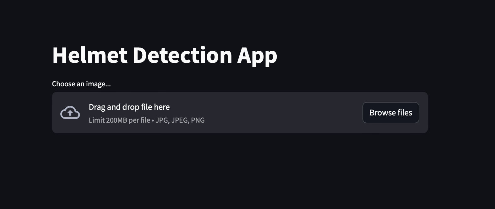
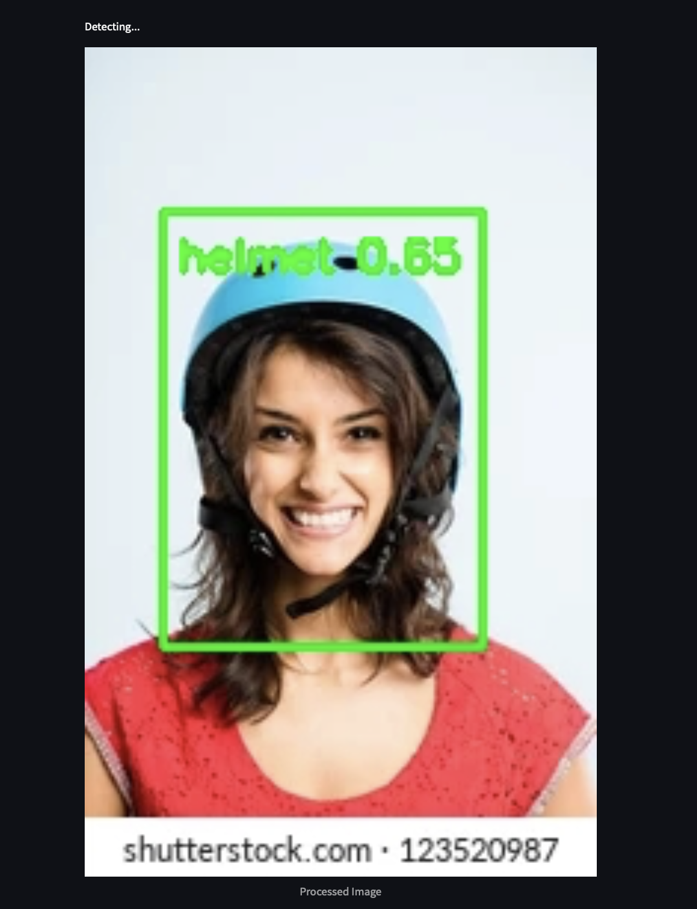

# helmet_safety_yolov10
This project uses YOLOv10 to detect whether a person is wearing a safety helmet or not.

1. Clone the repository:
    Open Terminal and enter command
    + For Windows: git clone https://github.com/chaupmbn/helmet_safety_yolov10.git
    + For MacOS: git@github.com:chaupmbn/helmet_safety_yolov10.git
2. Open the application:
    streamlit run */helmet_safety_yolov10/helmet_safety.py
    If the application open succesfully, it will be like this picture:
    
3. Upload the photo to detect:
    Click the "Browse files" button and upload your photo (up to 200MB).
4. The result will be shown as this sample:
    